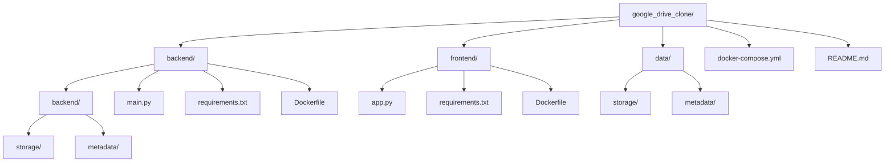

# 🗂️ Google Drive Clone with FastAPI + Streamlit + Docker

A simple full-stack Google Drive clone application built using **FastAPI** (backend) and **Streamlit** (frontend), containerized with **Docker Compose**. It uses local filesystem storage for files and metadata.

---

## 📌 Features

- ✅ Upload files via Streamlit UI
- ✅ Store uploaded files locally in `/storage`
- ✅ Store file metadata (size, content type, headers, upload timestamp) in `/metadata`
- ✅ View list of uploaded files
- ✅ Download or delete files
- ✅ Persistent storage with Docker volumes
- ✅ Fully containerized using Docker Compose

---

## 📁 Project Structure



- `backend/` — FastAPI app and Dockerfile
- `frontend/` — Streamlit UI and Dockerfile
- `data/` — Host volumes for file storage and metadata
- `docker-compose.yml` — Orchestrates backend & frontend containers
- `README.md` — Project documentation

---

## 🚀 Getting Started

### 1. Clone the Repository

```bash
git clone https://github.com/your-username/google-drive-clone.git
cd google-drive-clone
```

### 2. Create Data Directories for Volumes

```bash
mkdir -p data/storage
mkdir -p data/metadata
```

These folders persist uploaded files and metadata even after containers are stopped.

### 3. Build and Run with Docker Compose

```bash
docker-compose up --build
```

---

## 🌐 App Access

- 🔵 **Frontend (Streamlit UI):** [http://localhost:8501](http://localhost:8501)
- 🟢 **Backend (FastAPI API Docs):** [http://localhost:8000/docs](http://localhost:8000/docs)

---

## 🧪 Example Usage

1. Go to [http://localhost:8501](http://localhost:8501)
2. Upload any file via the Streamlit uploader
3. Metadata is automatically generated and saved
4. View all uploaded files
5. Download or delete them with one click

---

## 🧰 Tech Stack

| Component   | Technology        |
|-------------|------------------|
| Backend     | FastAPI          |
| Frontend    | Streamlit        |
| Runtime     | Docker           |
| Orchestration | Docker Compose |
| Storage     | Local filesystem (volumes) |

---

## 🔁 Volume Mounts

| Host Directory     | Container Path             | Purpose               |
|--------------------|---------------------------|-----------------------|
| `data/storage/`    | `/app/backend/storage`    | File storage volume   |
| `data/metadata/`   | `/app/backend/metadata`   | File metadata volume  |

---

## ⚠️ Troubleshooting

**🐍 `streamlit: not found` error in Docker**

This happens if Streamlit is missing from `frontend/requirements.txt`.
✅ Ensure Streamlit is present and rebuild:

```bash
docker-compose down --volumes --remove-orphans
docker-compose build --no-cache
docker-compose up
```

---

## 📌 Future Enhancements

- Add user authentication
- Switch metadata to SQLite or PostgreSQL
- Cloud storage (e.g., AWS S3 or GCP)
- Preview images and PDFs
- Add file rename and search functionality

---

## 📜 License

This project is licensed under the [MIT License](LICENSE).
Feel free to use and modify for personal or commercial purposes.

---

## 🤝 Contributing

PRs are welcome! If you'd like to improve the app or add new features, fork the repo and submit a pull request.

---

## 👨‍💻 Author

**Vipul Singh**

- 📫 [LinkedIn](https://www.linkedin.com/in/vipul-singh-664b3021b/)
- 💻 [GitHub](https://github.com/VipulSingh2)

---

## 📸 Screenshots

<!-- Add screenshots here if desired! Example: -->
<!--  -->


---

## 🏗️ Deployment

Want to deploy this to EC2 or automate builds with GitHub Actions? Let me know and I'll add a deployment guide!

---

```
